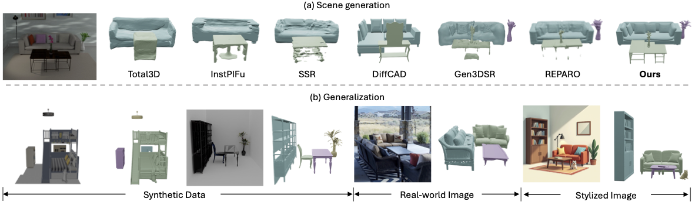

# MIDI: Multi-Instance Diffusion for Single Image to 3D Scene Generation

## 🏠 <a href="https://huanngzh.github.io/MIDI-Page/" target="_blank">Project Page</a> | <a href="" target="_blank">Paper</a>



MIDI is a **novel paradigm** for compositional 3D scene generation from a single image. MIDI extends pre-trained image-to-3D object generation models to **multi-instance diffusion models**, enabling the simultaneous generation of multiple 3D instances with accurate spatial relationships and high generalizability.

## Citation

```
@article{huang2024midi,
  title={MIDI: Multi-Instance Diffusion for Single Image to 3D Scene Generation},
  author={Huang, Zehuan and Guo, Yuanchen and An, Xingqiao and Yang, Yunhan and Li, Yangguang and Zou, Zixin and Liang, Ding and Liu, Xihui and Cao, Yanpei and Sheng, Lu},
  journal={},
  year={2024}
}
```
